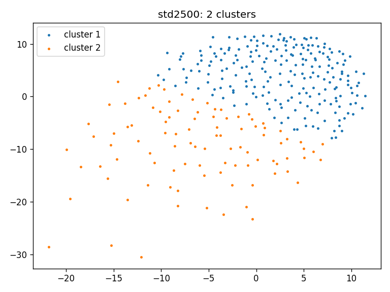
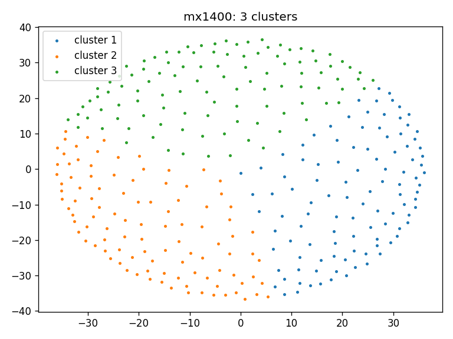
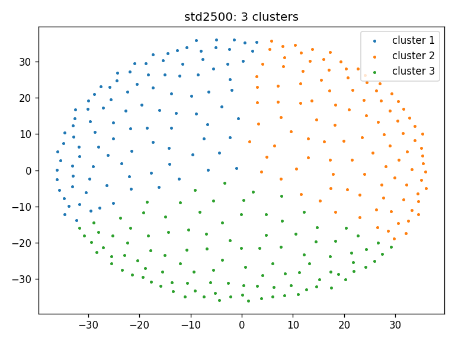
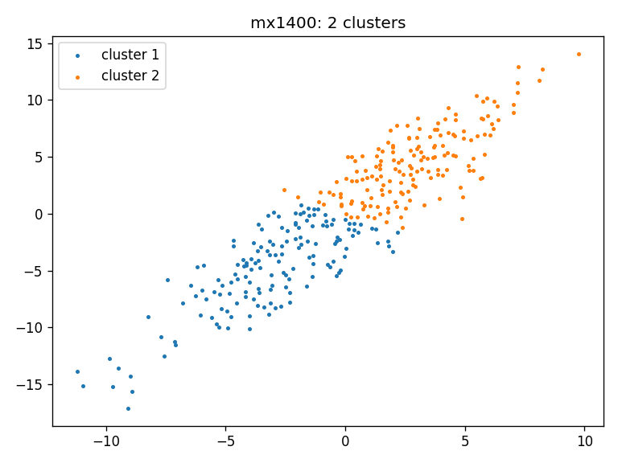
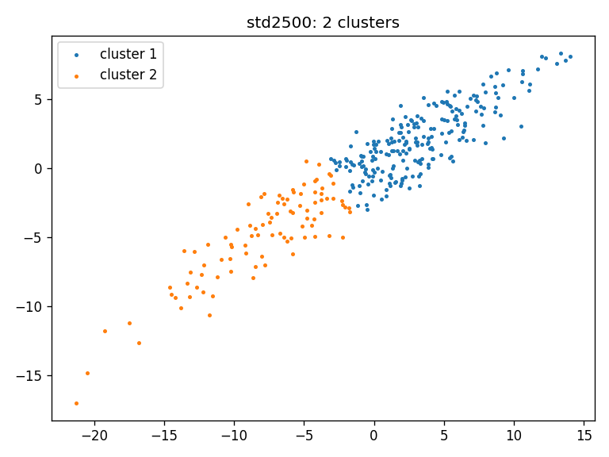
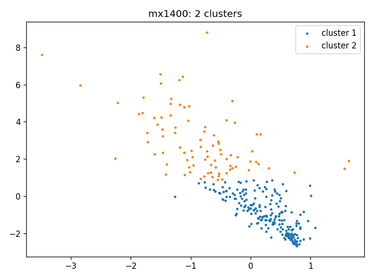

## TDA cluster generation (linear downsample data)
### Clustering result (within cohort):
```shell
python cluster_calculation.py --output_dir output_linear_downsample

Number of clusters in 3 cohorts: [2, 2, 2]
output_linear_downsample:
Cluster group: 000: #match: 27
Cluster group: 001: #match: 81
Cluster group: 010: #match: 21
Cluster group: 011: #match: 7
Cluster group: 100: #match: 27
Cluster group: 101: #match: 31
Cluster group: 110: #match: 110
Cluster group: 111: #match: 12
Generated output_linear_downsample/clusters_triplet.json

Max + rev: 110 + 81 = 191

Adjacency matrix:
output_linear_downsample:
Rows X Columns: [645 clusters, 1400 clusters, 2500 clusters]
136 0 108 28 48 88 
0 180 58 122 137 43 
108 58 166 0 54 112 
28 122 0 150 131 19 
48 137 54 131 185 0 
88 43 112 19 0 131 

```
- Clustering result for random data for all three cohorts using Wasserstein distance: 
  - mx645: 
  - mx1400: 
  - std2500: 
### Statistical analysis on tda pipeline with positive linear data (across cohort):
```shell
python statistical_calculation_linear.py --output_dir output_linear_downsample
T-values:
0.137380 0.362524 0.621848 
P-values:
0.182718 0.439049 0.686200 
ANOVA test p-value: 0.460228
```
- T-values and p-values obtained by pairwise t-tests
comparing the WDs between data cohorts. Since all p-values
are **larger** than 0.05, the means of WD distributions for each
cohort comparison are statistically **similar**.


|            |            | t-value  | p-value  |
|------------|------------|----------|----------|
| WD(P1, P2) | WD(P2, P3) | 0.137380 | 0.182718 |
| WD(P2, P3) | WD(P3, P1) | 0.362524 | 0.439049 |
| WD(P3, P1) | WD(P1, P2) | 0.621848 | 0.686200 |

## TDA cluster generation (positive linear data)
### Clustering result (within cohort):
```shell
python cluster_calculation.py --output_dir output_positive_linear
Number of clusters in 3 cohorts: [2, 2, 2]
output_positive_linear:
Cluster group: 000: #match: 24
Cluster group: 001: #match: 7
Cluster group: 010: #match: 26
Cluster group: 011: #match: 83
Cluster group: 100: #match: 115
Cluster group: 101: #match: 12
Cluster group: 110: #match: 20
Cluster group: 111: #match: 29

Max + reverse: 115 + 83 = 198

Adjacency matrix:
output_positive_linear:
Rows X Columns: [645 clusters, 1400 clusters, 2500 clusters]
140 0 31 109 50 90 
0 176 127 49 135 41 
31 127 158 0 139 19 
109 49 0 158 46 112 
50 135 139 46 185 0 
90 41 19 112 0 131 

```
- Clustering result for random data for all three cohorts using Wasserstein distance: 
  - mx645: 
  - mx1400: 
  - std2500: 
### Statistical analysis on tda pipeline with positive linear data (across cohort):
```shell
python statistical_calculation_linear.py --output_dir output_positive_linear
T-values:
0.059466 0.460986 0.286332 
P-values:
0.088657 0.520177 0.387527 
ANOVA test p-value: 0.291106
```
- T-values and p-values obtained by pairwise t-tests
comparing the WDs between data cohorts. Since all p-values
are **larger** than 0.05, the means of WD distributions for each
cohort comparison are statistically **similar**.


|            |            | t-value  | p-value  |
|------------|------------|----------|----------|
| WD(P1, P2) | WD(P2, P3) | 0.059466 | 0.088657 |
| WD(P2, P3) | WD(P3, P1) | 0.460986 | 0.520177 |
| WD(P3, P1) | WD(P1, P2) | 0.286332 | 0.387527 |


### Old d(u,v) (sqrt) equation
- Similarity between clusters:
```commandline
Cluster group: 000: #match: 26
Cluster group: 001: #match: 60
Cluster group: 010: #match: 22
Cluster group: 011: #match: 3
Cluster group: 100: #match: 40
Cluster group: 101: #match: 25
Cluster group: 110: #match: 134
Cluster group: 111: #match: 6

Max + rev = 134 + 60 = 194

Cluster group: 000: #match: {264, 140, 13, 268, 159, 289, 295, 168, 170, 298, 174, 49, 54, 182, 57, 314, 69, 74, 78, 92, 105, 110, 113, 242, 120, 125}
Cluster group: 001: #match: {128, 130, 3, 132, 5, 134, 7, 12, 14, 16, 145, 147, 275, 21, 280, 154, 285, 158, 35, 165, 38, 39, 40, 173, 302, 47, 303, 304, 179, 52, 53, 308, 309, 311, 185, 186, 312, 316, 191, 194, 197, 199, 73, 204, 206, 207, 84, 212, 86, 213, 216, 94, 95, 223, 228, 101, 230, 248, 253, 127}
Cluster group: 010: #match: {256, 9, 10, 266, 273, 18, 274, 277, 23, 163, 292, 37, 45, 301, 307, 181, 315, 60, 80, 208, 82, 87}
Cluster group: 011: #match: {225, 29, 151}
Cluster group: 100: #match: {257, 133, 269, 144, 17, 146, 276, 149, 30, 288, 34, 164, 41, 169, 44, 48, 306, 180, 188, 63, 203, 210, 83, 211, 222, 98, 226, 100, 122, 231, 104, 107, 236, 237, 239, 112, 246, 250, 124, 254}
Cluster group: 101: #match: {6, 263, 270, 20, 150, 152, 282, 162, 291, 171, 176, 178, 51, 58, 66, 67, 77, 90, 220, 93, 232, 111, 118, 249, 252}
Cluster group: 110: #match: {1, 2, 4, 8, 11, 15, 19, 22, 24, 26, 27, 28, 31, 32, 33, 36, 42, 43, 46, 55, 56, 59, 61, 64, 65, 68, 70, 71, 72, 75, 76, 79, 85, 88, 89, 91, 96, 97, 99, 102, 103, 106, 108, 109, 114, 115, 116, 117, 119, 121, 123, 126, 129, 131, 135, 136, 137, 138, 139, 141, 142, 143, 148, 153, 155, 156, 157, 160, 161, 166, 167, 172, 175, 177, 183, 187, 189, 190, 192, 193, 195, 196, 198, 200, 201, 202, 205, 209, 214, 215, 217, 218, 219, 221, 224, 227, 229, 233, 234, 235, 238, 240, 241, 243, 244, 245, 247, 251, 258, 259, 260, 261, 262, 265, 267, 271, 272, 278, 279, 281, 283, 284, 286, 287, 290, 293, 294, 296, 297, 299, 300, 305, 310, 313}
Cluster group: 111: #match: {81, 50, 184, 25, 62, 255}
```
- Adjacency matrix between cluster:
```commandline
# columns: cluster_645[0], cluster_645[1], cluster_1400[0], cluster_1400[1], cluster_2500[0], cluster_2500[1]

111 0 86 25 48 63 
0 205 65 140 174 31 
86 65 151 0 66 85 
25 140 0 165 156 9 
48 174 66 156 222 0 
63 31 85 9 0 94 
```
- Adjacency matrix between cluster (random):
```commandline
# columns: cluster_645[0], cluster_645[1], cluster_1400[0], cluster_1400[1], cluster_2500[0], cluster_2500[1]

150 0 73 77 69 81 
0 166 68 98 78 88 
73 68 141 0 71 70 
77 98 0 175 76 99 
69 78 71 76 147 0 
81 88 70 99 0 169 
```
- Similarity between clusters (random):
```commandline

Cluster group: 000: match: {3, 6, 266, 269, 144, 147, 23, 279, 287, 36, 292, 48, 305, 179, 309, 182, 56, 58, 198, 75, 78, 206, 80, 207, 119, 89, 219, 92, 221, 99, 233, 238, 115, 247, 254}
Cluster group: 001: match: {257, 261, 8, 264, 10, 270, 273, 19, 148, 275, 276, 277, 281, 156, 285, 157, 160, 169, 174, 176, 306, 52, 181, 184, 313, 61, 191, 200, 81, 211, 214, 93, 101, 103, 107, 243, 246, 253}
Cluster group: 010: match: {131, 132, 11, 17, 145, 24, 153, 26, 155, 30, 163, 164, 39, 168, 42, 170, 44, 175, 51, 180, 307, 187, 60, 66, 77, 208, 85, 87, 217, 97, 231, 104, 106, 250}
Cluster group: 011: match: {256, 130, 5, 13, 142, 16, 278, 154, 282, 29, 31, 32, 288, 37, 294, 295, 40, 301, 46, 310, 312, 314, 189, 190, 192, 194, 69, 72, 202, 203, 79, 209, 84, 220, 228, 235, 237, 111, 239, 114, 242, 121, 252}
Cluster group: 100: match: {263, 138, 274, 18, 21, 150, 25, 284, 286, 159, 158, 291, 296, 41, 297, 299, 303, 49, 177, 62, 205, 212, 88, 224, 98, 226, 100, 227, 230, 234, 236, 118, 123, 127, 126, 255}
Cluster group: 101: match: {128, 1, 2, 259, 260, 262, 9, 139, 268, 143, 272, 298, 47, 178, 54, 185, 315, 64, 65, 195, 197, 73, 74, 76, 82, 218, 91, 95, 105, 110, 116, 245}
Cluster group: 110: match: {258, 4, 133, 7, 136, 267, 280, 27, 28, 289, 162, 290, 167, 43, 171, 45, 300, 302, 304, 50, 53, 55, 186, 63, 68, 196, 70, 204, 210, 213, 86, 216, 90, 223, 248, 108, 109, 241, 120, 249, 124, 125}
Cluster group: 111: match: {129, 134, 135, 137, 265, 12, 140, 14, 15, 141, 271, 146, 20, 149, 22, 151, 152, 283, 33, 34, 35, 161, 165, 38, 166, 293, 172, 173, 308, 183, 311, 57, 59, 188, 316, 193, 67, 71, 199, 201, 83, 215, 94, 222, 96, 225, 229, 102, 232, 112, 113, 240, 244, 117, 122, 251}

Cluster group: 000: #match: 35
Cluster group: 001: #match: 38
Cluster group: 010: #match: 34
Cluster group: 011: #match: 43
Cluster group: 100: #match: 36
Cluster group: 101: #match: 32
Cluster group: 110: #match: 42
Cluster group: 111: #match: 56
```

## Non TDA cluster generation (Real data)
### Clustering result (within cohort):
```shell
python non_tda_cluster_calculation.py                                                      
Generated output_non_tda/clusters_mx645_ed.png
Generated output_non_tda/clusters_mx1400_ed.png
Generated output_non_tda/clusters_std2500_ed.png
Generated output_non_tda/clusters_ed.json
Number of clusters in 3 cohorts: [2, 2, 2]

output_non_tda:
Cluster group: 000: #match: 18
Cluster group: 001: #match: 51
Cluster group: 010: #match: 24
Cluster group: 011: #match: 8
Cluster group: 100: #match: 26
Cluster group: 101: #match: 24
Cluster group: 110: #match: 151
Cluster group: 111: #match: 14
Generated output_non_tda/clusters_triplet.json

Adjacency matrix:
output_non_tda:
Rows X Columns: [645 clusters, 1400 clusters, 2500 clusters]
101 0 69 32 42 59 
0 215 50 165 177 38 
69 50 119 0 44 75 
32 165 0 197 175 22 
42 177 44 175 219 0 
59 38 75 22 0 97 

Generated output_non_tda/clusters_adjancency.json
```
- Clustering result for all three cohorts using Euclidean distance (`np.linalg.norm`): 
  - mx645: 
  - mx1400: 
  - std2500: 
### Statistical analysis on non tda pipeline (across cohort):
```shell
python non_tda_statistical_calculation.py
T-values:
0.001731 0.000019 0.000000 
P-values:
0.040025 0.006077 0.000004 
ANOVA test p-value: 0.000012
```
- T-values and p-values obtained by pairwise t-tests
comparing the EDs between data cohorts. Since all p-values
are **less** than 0.05, the means of ED distributions for each
cohort comparison are statistically **dissimilar**.


|            |            | t-value  | p-value  |
|------------|------------|----------|----------|
| WD(P1, P2) | WD(P2, P3) | 0.001731 | 0.040025 |
| WD(P2, P3) | WD(P3, P1) | 0.000019 | 0.006077 |
| WD(P3, P1) | WD(P1, P2) | 0.000000 | 0.000004 |

## Non TDA cluster generation (Random data)
### Clustering result (within cohort) (random data):
```shell
Number of clusters in 3 cohorts: [3, 3, 3]
output_non_tda_random:
Cluster group: 000: #match: 0
Cluster group: 001: #match: 24
Cluster group: 002: #match: 11
Cluster group: 010: #match: 13
Cluster group: 011: #match: 0
Cluster group: 012: #match: 23
Cluster group: 020: #match: 24
Cluster group: 021: #match: 11
Cluster group: 022: #match: 0
Cluster group: 100: #match: 0
Cluster group: 101: #match: 19
Cluster group: 102: #match: 13
Cluster group: 110: #match: 11
Cluster group: 111: #match: 0
Cluster group: 112: #match: 29
Cluster group: 120: #match: 21
Cluster group: 121: #match: 13
Cluster group: 122: #match: 0
Cluster group: 200: #match: 0
Cluster group: 201: #match: 25
Cluster group: 202: #match: 15
Cluster group: 210: #match: 12
Cluster group: 211: #match: 0
Cluster group: 212: #match: 15
Cluster group: 220: #match: 23
Cluster group: 221: #match: 14
Cluster group: 222: #match: 0
Generated output_non_tda_random/clusters_triplet.json

Adjacency matrix:
output_non_tda_random:
Rows X Columns: [645 clusters, 1400 clusters, 2500 clusters]
106 0 0 35 36 35 37 35 34 
0 106 0 32 40 34 32 32 42 
0 0 104 40 27 37 35 39 30 
35 32 40 107 0 0 0 68 39 
36 40 27 0 103 0 36 0 67 
35 34 37 0 0 106 68 38 0 
37 32 35 0 36 68 104 0 0 
35 32 39 68 0 38 0 106 0 
34 42 30 39 67 0 0 0 106 

Generated output_non_tda_random/clusters_adjancency.json
```
- Clustering result for random data for all three cohorts using Euclidean distance (`np.linalg.norm`): 
  - mx645: 
  - mx1400: 
  - std2500: 
### Statistical analysis on non tda pipeline with random data (across cohort):
```shell
python non_tda_random_statistical_calculation.py
T-values:
0.028809 0.559694 0.124023 
P-values:
0.045081 0.588588 0.155242 
ANOVA test p-value: 0.122310
```
- T-values and p-values obtained by pairwise t-tests
comparing the EDs between data cohorts. Since all p-values
are **equal or larger** than 0.05, the means of ED distributions for each
cohort comparison are statistically **similar**.


|            |            | t-value  | p-value  |
|------------|------------|----------|----------|
| WD(P1, P2) | WD(P2, P3) | 0.028809 | 0.045081 |
| WD(P2, P3) | WD(P3, P1) | 0.559694 | 0.588588 |
| WD(P3, P1) | WD(P1, P2) | 0.124023 | 0.155242 |

### Mean and standard deviation of random clusters (49 out of 50)
```shell
Mean value of (Max + Reverse): 84.06122448979592
Standard deviation value of (Max + Reverse): 5.738786759358441
```

## TDA cluster generation (positive data)
### Clustering result (within cohort):
```shell
Generated output_positive/clusters_mx645_ws.png
Generated output_positive/clusters_mx1400_ws.png
Generated output_positive/clusters_std2500_ws.png
Generated output_positive/clusters_ws.json
Number of clusters in 3 cohorts: [2, 2, 2]
output_positive:
Cluster group: 000: #match: 26
Cluster group: 001: #match: 61
Cluster group: 010: #match: 22
Cluster group: 011: #match: 2
Cluster group: 100: #match: 40
Cluster group: 101: #match: 25
Cluster group: 110: #match: 134
Cluster group: 111: #match: 6
Generated output_positive/clusters_triplet.json

Max + rev = 134 + 61 = 195

Adjacency matrix:
output_positive:
Rows X Columns: [645 clusters, 1400 clusters, 2500 clusters]
111 0 87 24 48 63 
0 205 65 140 174 31 
87 65 152 0 66 86 
24 140 0 164 156 8 
48 174 66 156 222 0 
63 31 86 8 0 94 

Generated output_positive/clusters_adjancency.json

Method main executed in 5.2614 seconds
```
- Clustering result for random data for all three cohorts using Wasserstein distance: 
  - mx645: 
  - mx1400: 
  - std2500: 
### Statistical analysis on tda pipeline with positive data (across cohort):
```shell
T-values:
0.092487 0.023553 0.464024 
P-values:
0.129347 0.059304 0.572871 
ANOVA test p-value: 0.128747
```
- T-values and p-values obtained by pairwise t-tests
comparing the WDs between data cohorts. Since all p-values
are **equal or larger** than 0.05, the means of WD distributions for each
cohort comparison are statistically **similar**.


|            |            | t-value  | p-value  |
|------------|------------|----------|----------|
| WD(P1, P2) | WD(P2, P3) | 0.092487 | 0.129347 |
| WD(P2, P3) | WD(P3, P1) | 0.023553 | 0.059304 |
| WD(P3, P1) | WD(P1, P2) | 0.464024 | 0.572871 |

## TDA cluster generation (negative data)
### Clustering result (within cohort):
```shell
Generated output_negative/clusters_mx645_ws.png
Generated output_negative/clusters_mx1400_ws.png
Generated output_negative/clusters_std2500_ws.png
Generated output_negative/clusters_ws.json
Number of clusters in 3 cohorts: [3, 2, 2]
output_negative:
Cluster group: 000: #match: 20
Cluster group: 001: #match: 124
Cluster group: 010: #match: 12
Cluster group: 011: #match: 14
Cluster group: 100: #match: 23
Cluster group: 101: #match: 46
Cluster group: 110: #match: 24
Cluster group: 111: #match: 19
Cluster group: 200: #match: 8
Cluster group: 201: #match: 7
Cluster group: 210: #match: 16
Cluster group: 211: #match: 3
Generated output_negative/clusters_triplet.json

Adjacency matrix:
output_negative:
Rows X Columns: [645 clusters, 1400 clusters, 2500 clusters]
170 0 0 144 26 32 138 
0 112 0 69 43 47 65 
0 0 34 15 19 24 10 
144 69 15 228 0 51 177 
26 43 19 0 88 52 36 
32 47 24 51 52 103 0 
138 65 10 177 36 0 213 

Generated output_negative/clusters_adjancency.json

Method main executed in 5.7617 seconds
```
- Clustering result for random data for all three cohorts using Wasserstein distance: 
  - mx645: 
  - mx1400: 
  - std2500: 

### Statistical analysis on tda pipeline with negative data (across cohort):
```shell
python statistical_calculation_positive_negative.py
T-values:
0.000003 0.004331 0.000000 
P-values:
0.000012 0.110220 0.000000 
ANOVA test p-value: 0.000000
```
- T-values and p-values obtained by pairwise t-tests
comparing the WDs between data cohorts. Since all p-values
are **not equal or larger** than 0.05, the means of WD distributions for each
cohort comparison are statistically **dissimilar**.


|            |            | t-value  | p-value  |
|------------|------------|----------|----------|
| WD(P1, P2) | WD(P2, P3) | 0.000003 | 0.000012 |
| WD(P2, P3) | WD(P3, P1) | 0.004331 | 0.110220 |
| WD(P3, P1) | WD(P1, P2) | 0.000000 | 0.000000 |


