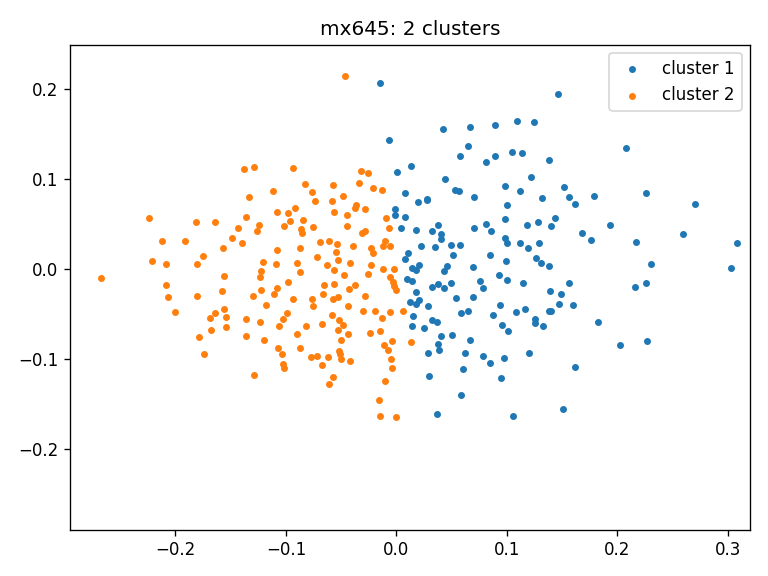
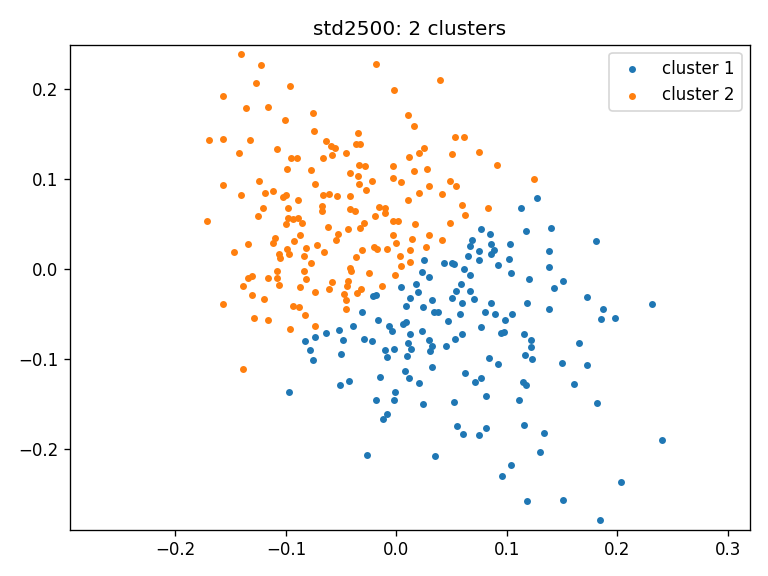

# Brain Persistent Homology

Using persistent homology and multidimensional scaling on Wasserstein distance
matrix

## Data pre-processing

### Input matrix

- S x C x N x N, where S = #subjects, C = #cohorts, N = #ROIs
- Mat file
- Size: 316 x 3 x 114 x 114
- Three cohorts: mx645, mx1400, std2500

### Data normalization

- Removed NaN values by removing column 24 and row 24 from each 114 x 114
  matrix
- Used correlation coefficients on transposed matrix and then applied square
  root on the 1 - squared distance
- 316 x 3 files, 3 files for each subject
- Each file contains 113 x 113 matrix
- Example: `subject_1_mx645.txt`,
  `subject_1_mx1400.txt`,
  `subject_1_std2500.txt`

## Pipeline 1: Comparison across cohorts

### Persistent homology

- Computed 0-dimensional persistent homology (PH) for all three cohorts of each
  subjects
- Generated 0-dimensional barcodes from calculated PH values with maximum value
  of 1
- To use persistent homology features from Gudhi library set 
  `manual=False` in 
  `get_barcodes_single_subject` method in [distance_calculation.py](distance_calculation.py). Otherwise, set 
  `manual=True` for raw calculation of persistent homology and 
  0-dimensional barcodes.

### Distance calculation

- Computed 1-Wasserstein Distance (WD) between cohorts for each
  subjects from the 0-dimensional barcodes
- For each subject, computed WD on the 0-dimensional barcodes:
    - WD(mx645 - mx1400)
    - WD(mx1400 - std2500)
    - WD(std2500 - mx645)
- Generated 1 JSON file with 316 arrays, each array contains 3 values
- Generated
  file: [distances_between_cohorts_ws.json](output/distances_between_cohorts_ws.json)

## Pipeline 2: Comparison within a cohort

### Persistent homology

- Computed 0-dimensional persistent homology (PH) for all three cohorts of each
  subjects
- Generated 0-dimensional barcodes from calculated PH values with maximum value
  of 1
- To use persistent homology features from Gudhi library set 
  `manual=False` in 
  `get_barcodes_single_subject` method in [distance_calculation.py](distance_calculation.py). Otherwise, set 
  `manual=True` for raw calculation of persistent homology and 
  0-dimensional barcodes.
### Distance matrix (Wasserstein distance)

- Computed 1-Wasserstein Distance (WD) matrix within a cohort separately
- For each cohort, computed WD distance matrix on the 0-dimensional barcodes:
    - WD_matrix(mx645): 316 x 316
    - WD_matrix(mx1400): 316 x 316
    - WD_matrix(std2500): 316 x 316
- Generated 3 JSON files each with 316 x 316 matrix
- Generated files:
    - [distance_matrix_mx645_ws.json](output/distance_matrix_mx645_ws.json)
    - [distance_matrix_mx1400_ws.json](output/distance_matrix_mx1400_ws.json)
    - [distance_matrix_std2500_ws.json](output/distance_matrix_std2500_ws.json)

### Multidimensional scaling (Wasserstein distance)

- Applied classical metric Multidimensional scaling (MDS) with precomputed
  distance (1-Wasserstein)
- Calculated MDS of 2 components for each 1-Wasserstein distance matrix
- Generated 3 JSON files each with 316 x 2 matrix
- Generated files:
    - [mds_mx645_ws.json](output/mds_mx645_ws.json)
    - [mds_mx1400_ws.json](output/mds_mx1400_ws.json)
    - [mds_std2500_ws.json](output/mds_std2500_ws.json)
- Applied Kmeans++ clustering by selecting the number of clusters `n` using
  Silhouette Coefficient.
    - [clustering_ws.json](output/clusters_ws.json)

## Statistical analysis

- Calculate `p-value` using ANOVA test on the [316 x 3] size Wasserstein
  distances between the cohorts
- ANOVA test p-value: 0.133
- Wasserstein distance for the following three pairs: (1) TR=645ms and 
  TR=1400ms, (2) TR=1400ms and TR=2500ms and, (1) TR=2500ms and TR=645ms 
  plotted using box plots: [boxplots](screenshots/distribution_boxplot.png)
- Plot WD distances between:
    - WD for all 316 subjects for mx645 and
      mx1400: [WD_mx645_mx1400](screenshots/WD_mx645_mx1400.png)
    - WD for all 316 subjects for mx1400 and
      std2500: [WD_mx1400_std2500](screenshots/WD_mx1400_std2500.png)
    - WD for all 316 subjects for std2500 and
      mx645: [WD_std2500_mx645](screenshots/WD_std2500_mx645.png)
- Plot MDS value for all three
  cohorts: [mds graph](screenshots/mds_graph_color.png)
- Clustering on the MDS results
    - Wasserstein distance: 
      - Single figure: [clustering_ws](screenshots/clusters_ws.png)
      - mx1400: [clusters_mx1400_ws](screenshots/clusters_mx1400_ws.png)
      - mx645: [clusters_mx645_ws](screenshots/clusters_mx645_ws.png)
      - std2500: [clusters_std2500_ws](screenshots/clusters_std2500_ws.png)

## Local Setup

### Requirements

- Python 3

### Install dependencies

- Clone the repository.
- Open a terminal / powershell in the cloned repository.
- Create a virtual environment and activate it. If you are using Linux / Mac:

```commandline
python3 -m venv venv
source venv/bin/activate
```

Create and activate `venv` in Windows (Tested in Windows 10):

```commandline
python -m venv venv
Set-ExecutionPolicy -ExecutionPolicy RemoteSigned -Scope CurrentUser
.\venv\Scripts\Activate.ps1
```

After activating `venv`, the terminal / powershell will have `(venv)` added to
the prompt.

- Check `pip` version:

```commandline
pip --version
```

It should point to the `pip` in the activated `venv`.

- Install required packages:

```commandline
pip install -r requirements.txt
```

### Run the project:

- Calculate distance between cohorts and MDS within a cohort using WD:

```commandline
python distance_calculation.py --method ws --start 1 --end 316 --distance y --mds y --data_dir full_data_linear --output_dir output_linear
```

- Draw plots and ANOVA test:

```commandline
python statistical_calculation_linear.py --output_dir output_linear
```

- Generate clusters on the MDS data:

```commandline
python cluster_calculation.py --output_dir output_linear
```

### Results
- Generate distance and MDS:
```shell
python distance_calculation.py --method ws --start 1 --end 316 --distance y --mds y --data_dir full_data_linear --output_dir output_linear
```
- Running statistical analysis on the generated file:

```commandline
python statistical_calculation_linear.py --output_dir output_linear
T-values:
0.059044 0.459634 0.286013 
P-values:
0.088131 0.518936 0.387180 
ANOVA test p-value: 0.289941
Mean WD_MX645_MX1400: 4.304
Mean WD_MX1400_STD2500: 4.01
Mean WD_STD2500_MX645: 4.135
WD_MX645_MX1400: Distance:   2, number of subjects:  42, percentage: 13.29%
WD_MX645_MX1400: Distance:   5, number of subjects: 207, percentage: 65.51%
WD_MX645_MX1400: Distance>  10, number of subjects:   4, percentage: 1.27%
Method main executed in 128.7125 seconds
```
- T-values and p-values obtained by pairwise t-tests
comparing the WDs between data cohorts. Since all p-values
are greater than 0.05, the means of WD distributions for each
cohort comparison are statistically similar.


|            |            | t-value  | p-value  |
|------------|------------|----------|----------|
| WD(P1, P2) | WD(P2, P3) | 0.059044 | 0.088131 |
| WD(P2, P3) | WD(P3, P1) | 0.459634 | 0.518936 |
| WD(P3, P1) | WD(P1, P2) | 0.286013 | 0.387180 |


- Wasserstein distance for the following three pairs: (1) TR=645ms and 
  TR=1400ms, (2) TR=1400ms and TR=2500ms and, (1) TR=2500ms and TR=645ms 
  plotted using box plots:
  
- WD for all 316 subjects for mx645 and mx1400:
  
- WD for all 316 subjects for mx1400 and std2500:
  
- WD for all 316 subjects for std2500 and mx645:
  
- Clustering result for all three cohorts using Wasserstein distance:
  - mx1400: 
  - mx645: 
  - std2500: 

### Generated files:

- [distances_between_cohorts_ws.json](output_linear/distances_between_cohorts_ws.json)
- [distance_matrix_mx645_ws.json](output_linear/distance_matrix_mx645_ws.json)
- [distance_matrix_mx1400_ws.json](output_linear/distance_matrix_mx1400_ws.json)
- [distance_matrix_std2500_ws.json](output_linear/distance_matrix_std2500_ws.json)
- [mds_mx645_ws.json](output_linear/mds_mx645_ws.json)
- [mds_mx1400_ws.json](output_linear/mds_mx1400_ws.json)
- [mds_std2500_ws.json](output_linear/mds_std2500_ws.json)
- [clustering_ws.json](output_linear/clusters_ws.json)

# Clustering results (review update)
## TDA cluster generation (linear data)
### Clustering result (within cohort):
```shell
python cluster_calculation.py --output_dir output_linear

Number of clusters in 3 cohorts: [2, 2, 2]
output_linear:
Cluster group: 000: #match: 24
Cluster group: 001: #match: 7
Cluster group: 010: #match: 26
Cluster group: 011: #match: 83
Cluster group: 100: #match: 115
Cluster group: 101: #match: 12
Cluster group: 110: #match: 20
Cluster group: 111: #match: 29

Max + reverse: 115 + 83 = 198

645-1400 : 236
1400-2500 : 251
2500-645 : 225

Adjacency matrix:
output_linear:
Rows X Columns: [645 clusters, 1400 clusters, 2500 clusters]
140 0 31 109 50 90 
0 176 127 49 135 41 
31 127 158 0 139 19 
109 49 0 158 46 112 
50 135 139 46 185 0 
90 41 19 112 0 131 
```
- Clustering result for full data for all three cohorts using Wasserstein distance: 
  - mx645: 
  - mx1400: 
  - std2500: 
### Statistical analysis on tda pipeline with linear data (across cohort):
```shell
python statistical_calculation_linear.py --output_dir output_linear
T-values:
0.059044 0.459634 0.286013 
P-values:
0.088131 0.518936 0.387180 
ANOVA test p-value: 0.289941
```
- T-values and p-values obtained by pairwise t-tests
comparing the WDs between data cohorts. Since all p-values
are **larger** than 0.05, the means of WD distributions for each
cohort comparison are statistically **similar**.


|            |            | t-value  | p-value  |
|------------|------------|----------|----------|
| WD(P1, P2) | WD(P2, P3) | 0.059044 | 0.088131 |
| WD(P2, P3) | WD(P3, P1) | 0.459634 | 0.518936 |
| WD(P3, P1) | WD(P1, P2) | 0.286013 | 0.387180 |


## TDA cluster generation (random data - 1 sample)
### Clustering result (within cohort):
```shell
python cluster_calculation.py --output_dir output_random
Number of clusters in 3 cohorts: [2, 2, 2]
output_random:
Cluster group: 000: #match: 35
Cluster group: 001: #match: 38
Cluster group: 010: #match: 34
Cluster group: 011: #match: 43
Cluster group: 100: #match: 36
Cluster group: 101: #match: 32
Cluster group: 110: #match: 42
Cluster group: 111: #match: 56

Max + reverse: 56 + 35 = 91

Adjacency matrix:
output_random:
Rows X Columns: [645 clusters, 1400 clusters, 2500 clusters]
150 0 73 77 69 81 
0 166 68 98 78 88 
73 68 141 0 71 70 
77 98 0 175 76 99 
69 78 71 76 147 0 
81 88 70 99 0 169 
```
- Clustering result for random data for all three cohorts using Wasserstein distance: 
  - mx645: 
  - mx1400: 
  - std2500: 


### Mean and standard deviation of random clusters (49 out of 50)
```shell
Mean value of (Max + Reverse): 84.06122448979592
Standard deviation value of (Max + Reverse): 5.738786759358441
```

### Notes
- Within cohort: clustering
- Across cohorts: statistical analysis
- Original dataset: [timeseries.Yeo2011.mm316.mat](full_data/timeseries.Yeo2011.mm316.mat)
- Total negative in correlation coefficient: 1234732 from [all_positive_linear.m](matlab/all_positive_linear.m)
- Total positive in correlation coefficient: 10870280 from [all_negative_linear.m](matlab/all_negative_linear.m)

### To Do:
- [x] non-TDA experiments for within cohort and comparison across cohort
- [x] nonTDA on random for second pipeline
- [x] create two matrices one for positive values and one for negative values and apply the distance function on them. Since, this will be a lot of experiments, if we do this for everything, let us just start by doing with only pipeline 1 (box plots, p/t-value tests).  the original mat file which we normalized using matlab. 113 x 113 with all positive (padded by 0) and 113 x 113 with all negative (padded by 0).

### References

- [Rips complex user manual](https://gudhi.inria.fr/python/latest/rips_complex_user.html)
- [Wasserstein distance user manual](https://gudhi.inria.fr/python/3.3.0/wasserstein_distance_user.html)
- [Bottleneck docs](https://gudhi.inria.fr/python/latest/bottleneck_distance_user.html)
- [ANOVA test using scipy docs](https://docs.scipy.org/doc/scipy/reference/generated/scipy.stats.f_oneway.html)
- [T-test using scipy docs](https://docs.scipy.org/doc/scipy/reference/generated/scipy.stats.ttest_rel.html#scipy.stats.ttest_rel)